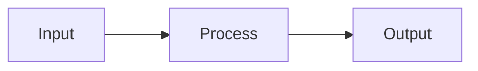
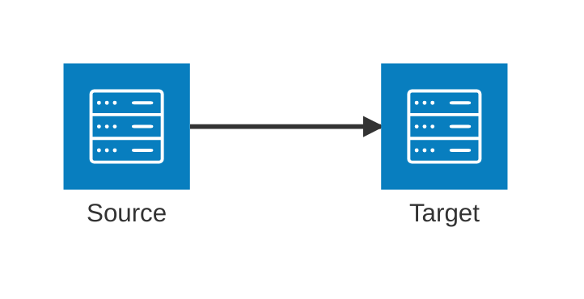
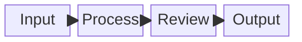
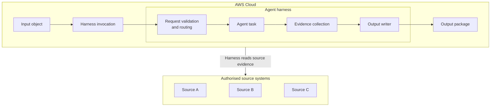

# Compose Mermaid Diagrams

Produce the smallest diagram that communicates the intended architecture or
process clearly. Treat rendering and visual inspection as part of composition,
not as an optional final check.

## Workflow

1. Read the surrounding document and existing Mermaid source.
2. Preserve the document's established visual language unless the user asks to
   change it.
3. Choose the diagram type deliberately.
4. Establish hierarchy, reading direction, and node placement before styling.
5. Render the complete Markdown file to a new PNG.
6. Inspect the PNG at original detail.
7. Adjust source, routing, spacing, or labels and render again.
8. Run `git diff --check` after editing a tracked workspace document.

Never report a diagram as verified from source inspection or `mmdc` console
output alone.

## Choose the diagram type

### Prefer `flowchart` for rectangle-based architecture diagrams

Use a standard flowchart when the desired visual language is:

- simple rectangles with text inside;
- labelled nested boundaries such as AWS Cloud and an AgentCore harness;
- a clear left-to-right or top-to-bottom process;
- Markdown and Confluence compatibility; or
- minimal visual decoration.

This is the default for AP+ architecture material.

Use orthogonal routing:



`step`, `stepBefore`, and `stepAfter` change how rectangular bends are drawn.
They do not select the side of a rectangle where an edge attaches.

### Use `architecture-beta` only for an icon-based service view

Use `architecture-beta` when service icons and explicit edge ports are desired.
It supports `L`, `R`, `T`, and `B` ports:



Do not use it as a way to improve an existing rectangle diagram. It changes
services into icons with labels underneath.

Verified Mermaid 11.15 constraints:

- force-directed placement can overlap labels in a busy group;
- `align row` and `align column` require Mermaid 11.16 or later;
- multiple edges using the same port can collapse or distort the layout;
- `{group}` is valid only when an edge actually traverses group boundaries;
- cross-boundary edges through deep nested groups are fragile;
- `+` and commas in unquoted architecture labels can trigger lexer errors;
- the visual result may differ significantly from a rectangle flowchart.

Prefer one edge per port. Flatten nesting or simplify the topology before
trying additional spacing or random seeds.

### Use `block` for a grid without important container labels

Block diagrams provide explicit columns, spans, and spaces. They are useful
when exact placement matters more than named architecture boundaries.



Composite blocks do not reproduce labelled nested subgraphs as effectively as
flowcharts. Do not switch to `block` merely to fix a flowchart that can be
stabilised structurally.

## Compose rectangle architecture diagrams

Use a top-level direction for the major rows and a local direction for each
container. Keep a single dominant reading path.

The following pattern is verified for a horizontal AWS workflow with a source
system row beneath it:



This pattern works because:

- the top-level `TB` direction creates two major rows;
- `AWS` and `HARNESS` both use `LR`, so external links do not rotate the inner
  process unexpectedly;
- the primary processing path is a real directed chain;
- invisible `~~~` links hold independent source boxes in one row; and
- the cross-container relationship connects boundaries rather than a deeply
  nested node.

Use two visual nodes for one physical store when a single read/write node would
create a layout cycle. State in prose that the input and output nodes represent
different prefixes or views of the same store.

## Control flowchart placement indirectly

Standard flowcharts do not provide explicit node-side ports. Control the
layout with structure:

- Set `flowchart LR`, `TB`, `RL`, or `BT` for the dominant reading direction.
- Give nested subgraphs a direction matching the intended internal flow.
- Use real directed chains to establish ranks.
- Use `~~~` invisible links for alignment without a visible relationship.
- Add dashes such as `--->` or `---->` to request a longer minimum edge.
- Increase `nodeSpacing` for peers and `rankSpacing` for process stages.
- Introduce a small routing node only when it represents a real boundary or
  hand-off.
- Duplicate a logical input/output view when avoiding a cycle is clearer than
  forcing one node into two ranks.

Important subgraph limitation: if an external edge connects directly to a node
inside a subgraph, Mermaid can ignore that subgraph's local `direction` and
inherit its parent direction. Use one of these treatments:

1. connect the external edge to the subgraph boundary;
2. make the child and parent directions the same;
3. move the externally connected node to the parent level; or
4. restructure the diagram into major rows or columns.

Do not fight a direction conflict with CSS.

## Keep labels and styling stable

- Use `<br/>` for deliberate wrapping inside flowchart rectangles.
- Quote labels containing punctuation that can affect Mermaid parsing.
- Keep node text short enough to scan at normal page width.
- Put explanations in the surrounding prose instead of overloading boxes.
- Start with Mermaid's default colours and text.
- Add styles only after layout is stable.
- When colour or text becomes inconsistent, remove all custom style rules and
  add them back one at a time.
- Set both fill/stroke and text colour explicitly only when the destination
  renderer has been tested; themes can override individual declarations.

Avoid using CSS to simulate layout, ports, or spacing. Mermaid's layout engine
does not treat visual CSS as graph constraints.

## Render through `mmdc`

Check the installed renderer first when syntax support matters:

```sh
mmdc --version
```

For a Markdown document containing Mermaid blocks:

```sh
mmdc -i /absolute/path/document.md \
  -o /tmp/diagram-render.md \
  -a /tmp/diagram-render-assets \
  -e png \
  -w 2400 \
  -H 1600
```

Use a new output name for each iteration so stale images cannot be mistaken for
the latest render.

`mmdc` drives Chromium through Puppeteer. If the renderer process cannot start
in the current environment, treat that as an environment matter and follow the
user's global instructions for running restricted local tools.

## Diagnose parsing and rendering failures

`mmdc` processing a Markdown file can report success even when the generated
PNG contains Mermaid's “Syntax error in text” image. Always inspect the PNG.

When the PNG contains a syntax error:

1. extract or isolate the Mermaid block;
2. parse the diagram with the Mermaid package used by `mmdc` when available;
3. use the reported line and column rather than guessing;
4. reduce to a minimal working diagram if the parser message is unclear;
5. reintroduce declarations and edges in small groups; and
6. render the complete Markdown document again after the fix.

Useful failure patterns verified in Mermaid 11.15:

- architecture labels containing `AP+` or commas can fail lexing;
- an incorrect `{group}` modifier produces a group-boundary error;
- two architecture edges sharing one port can collapse the layout;
- a third nested group can make cross-boundary architecture routing fragile;
- linking an external group directly to a nested flowchart subgraph can rotate
  the entire parent layout; and
- visually blank or tiny PNGs are failures even when the command exits zero.

## Inspect the actual image

Open the PNG at original detail and check:

- every arrowhead points in the intended direction;
- the main reading path is obvious;
- lines begin and end cleanly and do not cross important labels;
- rectangular turns are consistent;
- peer boxes align to a row or column;
- containers include the intended components and exclude unrelated ones;
- no empty, duplicated, collapsed, or icon-substituted node appears;
- text is readable, black or suitably contrasted, and not clipped;
- labels do not overlap nodes, lines, or container titles;
- the diagram is not excessively wide or tall for its destination; and
- the rendered image is the newest output, not a cached earlier version.

If a diagram passes syntax validation but fails any visual check, continue
iterating.

## Confluence and renderer compatibility

Local rendering proves compatibility only with the installed Mermaid version.
Before relying on newer syntax such as `architecture-beta`, confirm the
Confluence Mermaid renderer version or retain a rectangle-flowchart fallback.

Prefer widely supported flowchart syntax for documents intended to move
between Markdown, Confluence, and image rendering.

## Completion standard

Finish only when:

- the source matches the requested visual language;
- the complete Markdown file renders without parser errors;
- the newest PNG has been inspected visually;
- routing, labels, hierarchy, and arrow direction are correct;
- surrounding document content remains intact; and
- workspace checks such as `git diff --check` pass.
