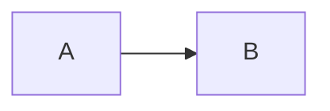

# Confluence Upload

Use this skill when a user asks to upload, create, or update a Confluence page from local content, or when a Confluence page needs native formatting that Markdown/HTML may not preserve.

## Source Selection

1. For Confluence URLs, use Atlassian MCP first to read source pages and metadata.
2. Use the page ID from URLs like `/pages/3584459105/...` or `/pages/edit-v2/3584459105`.
3. Use `getConfluencePage` to confirm:
   - `spaceId`
   - `parentId`
   - current title
   - current version when updating
4. If upload content is large, cache source or transformed material under `./cache` or `/tmp`.

## Creation Workflow

1. Decide the Confluence page title separately from the body.
   - Do not repeat a Markdown top-level `# Title` inside the body when Confluence will set the page title.
   - Remove the first Markdown H1 from body content unless the user explicitly wants it duplicated.
2. If the source is Markdown, inspect it for embedded Mermaid diagrams before converting the body.
   - Render supported diagram blocks to PNG and replace the original code block location with a Confluence image reference.
   - See [Embedded Mermaid Diagrams](#embedded-mermaid-diagrams).
3. Search for an existing page with the target title before creating a page.
   - Use CQL, for example: `space = ARCH AND title = "..." AND type = page`.
4. Create under the requested parent page ID.
5. After creation or update, fetch the page back and verify:
   - title
   - parent ID
   - version
   - body representation and critical native nodes
6. If a Jira ticket tracks the page, add or update a Jira comment with the Confluence page link.

## MCP Versus REST

Use Atlassian MCP `createConfluencePage` or `updateConfluencePage` when plain Markdown or simple supported HTML is sufficient.

Use Confluence REST API when exact native page representation is needed, especially:

- status lozenges
- rich tables with status cells
- ADF-native content
- preserving Confluence-specific nodes

## Embedded Mermaid Diagrams

When uploading Markdown that contains fenced Mermaid blocks, convert those blocks to PNG images and embed the PNGs in Confluence at the same location. Do not publish the Mermaid source as a visible code block unless the user explicitly asks for the source to remain visible.

Supported fence form:

````markdown

````

Use this workflow:

1. Extract each fenced `mermaid` block before normal Markdown-to-Confluence conversion.
2. Write each block to a generated `.mmd` file under `./cache`, `/tmp`, or the task's working directory.
3. Render each `.mmd` file to PNG with `mmdc`, using absolute input and output paths:

   ```sh
   mmdc -i /absolute/path/diagram-01.mmd \
     -o /absolute/path/page-slug-mermaid-01.png \
     -b transparent \
     -s 2
   ```

   Require exit status 0, then validate the resulting file with `file` or `sips`. A zero exit status alone is not proof of a good render; a blank, tiny, or "Syntax error in text" PNG is a failure.
4. If `mmdc` is unavailable, ask the user to install `@mermaid-js/mermaid-cli`. If the renderer process cannot start in the current environment, treat that as an environment matter and follow the user's global instructions for running restricted local tools.
5. Use stable, page-scoped filenames such as `page-slug-mermaid-01.png`, `page-slug-mermaid-02.png`.
6. Replace the original code fence with Confluence storage-format image XML:

   ```xml
   <p><ac:image ac:alt="page-slug-mermaid-01.png" ac:width="900"><ri:attachment ri:filename="page-slug-mermaid-01.png" /></ac:image></p>
   ```

7. Create or update the Confluence page only after accounting for attachment ordering:
   - Attachments need an existing Confluence content/page ID.
   - For new pages, create a simple page shell first, upload the generated PNG attachments to that page, then update the page body with the final storage/ADF content that references the attachments.
   - For existing pages, upload or update the PNG attachments on the existing page, then update the page body with the next version number.

Use the Confluence REST attachment endpoint because the Atlassian MCP tools may not expose attachment upload:

```sh
curl -sS -u "$ATLASSIAN_EMAIL:$ATLASSIAN_API_TOKEN" \
  -X PUT \
  -H "X-Atlassian-Token: nocheck" \
  -F "file=@page-slug-mermaid-01.png" \
  -F "minorEdit=true" \
  -F "comment=Generated from Mermaid block" \
  "https://auspayplus.atlassian.net/wiki/rest/api/content/{PAGE_ID}/child/attachment"
```

Then update the page body using storage format or ADF. For storage-format REST updates, include the image XML at the replacement location and increment the page version:

```json
{
  "id": "{PAGE_ID}",
  "type": "page",
  "title": "Page title",
  "space": { "key": "SPACEKEY" },
  "ancestors": [{ "id": "{PARENT_ID}" }],
  "body": {
    "storage": {
      "representation": "storage",
      "value": "<p>Before diagram</p><p><ac:image ac:alt=\"page-slug-mermaid-01.png\" ac:width=\"900\"><ri:attachment ri:filename=\"page-slug-mermaid-01.png\" /></ac:image></p><p>After diagram</p>"
    }
  },
  "version": {
    "number": 2,
    "message": "Render Mermaid diagrams as attached PNG images"
  }
}
```

Validation for Mermaid uploads:

- Fetch the page back with `getConfluencePage` using `contentFormat: "html"`.
- Confirm the body contains a Confluence media figure such as `data-type="media-single"` and the PNG filename, not a visible Mermaid code block.
- Confirm the attachment exists on the page. CQL can find it by `title = "page-slug-mermaid-01.png" AND type = attachment`; REST can list `/wiki/api/v2/pages/{PAGE_ID}/attachments`.
- Confirm Confluence may add `ri:version-at-save` to the storage body after upload; that is expected.

Tested AP+ behavior, 2026-06-09:

- Created a page shell with MCP, uploaded a Mermaid-generated PNG attachment using REST, then updated the page storage body with `<ac:image><ri:attachment ... /></ac:image>`.
- Confluence rendered the image as a media figure and associated it with the page attachment collection.

## Critical Learning: Status Lozenges

Confluence storage-format HTML may accept `<span data-type="status" data-color="...">LOW</span>` in some tool contexts, but direct REST storage upload can sanitise it into plain `<span>LOW</span>`.

When status labels must be native colored Confluence lozenges, use ADF with `representation: "atlas_doc_format"` and status nodes:

```json
{
  "type": "status",
  "attrs": {
    "color": "blue",
    "style": "bold",
    "text": "LOW",
    "localId": "generated-uuid"
  }
}
```

For the current AIA template, use this risk color mapping:

| Rating | ADF color |
| --- | --- |
| LOW | blue |
| MEDIUM | green |
| HIGH | yellow |
| EXTREME | red |

For legacy AIA pages using `MINOR`, map:

| Rating | ADF color |
| --- | --- |
| MINOR | blue |
| Low / LOW | green in old pages, blue in current AIA template |
| medium / MEDIUM | yellow in old pages, green in current AIA template |
| high / HIGH | red in old pages, yellow in current AIA template |

Always inspect the source/template page before choosing the mapping. In AP+ AIA v2 template, `LOW` is blue, `MEDIUM` is green, `HIGH` is yellow, and `EXTREME` is red.

## REST Create Payloads

For storage HTML:

```json
{
  "spaceId": "1889632301",
  "status": "current",
  "title": "Page title",
  "parentId": "3584459105",
  "body": {
    "representation": "storage",
    "value": "<p>Body</p>"
  }
}
```

For ADF:

```json
{
  "spaceId": "1889632301",
  "status": "current",
  "title": "Page title",
  "parentId": "3584459105",
  "body": {
    "representation": "atlas_doc_format",
    "value": "{\"version\":1,\"type\":\"doc\",\"content\":[...]}"
  }
}
```

For REST updates, include the page ID and increment the version:

```json
{
  "id": "4502979894",
  "status": "current",
  "title": "Page title",
  "parentId": "3584459105",
  "body": {
    "representation": "atlas_doc_format",
    "value": "{\"version\":1,\"type\":\"doc\",\"content\":[...]}"
  },
  "version": {
    "number": 2,
    "message": "Convert rating labels to native Confluence status lozenges"
  }
}
```

## Validation Checklist

After upload:

- Fetch the page with `contentFormat: "adf"` if native formatting matters.
- Confirm the returned body contains nodes like `"type": "status"`, not only text or plain `<span>`.
- Confirm the page title is not duplicated as the first body heading.
- Confirm parent page ID matches the requested parent.
- Confirm links to Jira and source documents are correct.
- If a REST create initially used storage HTML and stripped status attributes, update the same page using ADF rather than creating a duplicate.
